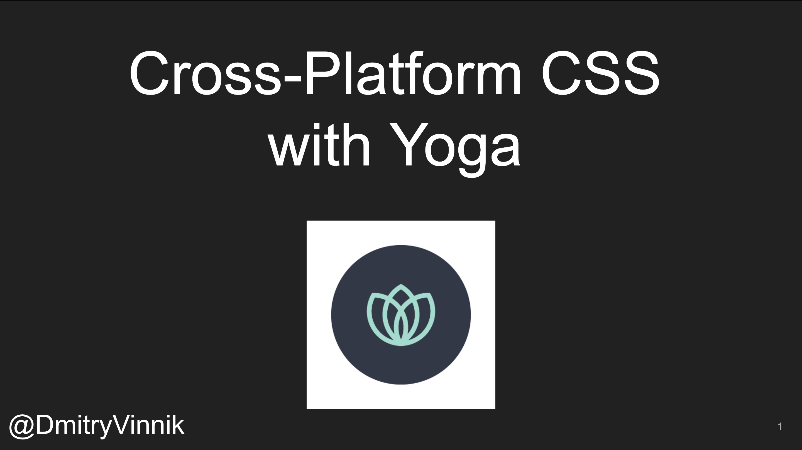

**Elevator Pitch (~300 words)**

In this talk, we learn about Yoga's main concepts and use-cases. Then, we will build a demo app for React Native and Android to showcase the reusability of Yoga.

**Abstract**
 
It's no secret that people view the same website across many devices, browsers, and screen sizes. To make the same app work on all these platforms, developers have to spend a significant amount of time. If only there were an engine that allows web developers to write their code once and use it everywhere.

Presenting Yoga, an open source, cross-platform layout engine that uses CSS layouts to manage user interfaces across platforms. 

In this talk, we learn about Yoga's main concepts and use-cases. Then, we will build a demo app for React Native and Android to showcase the reusability of Yoga.

**Slide Deck**

 

<iframe src="//www.slideshare.net/slideshow/embed_code/key/qXr7z1l7zxVuIr" width="595" height="485" frameborder="0" marginwidth="0" marginheight="0" scrolling="no" style="border:1px solid #CCC; border-width:1px; margin-bottom:5px; max-width: 100%;" allowfullscreen> </iframe> 
 <strong> <a href="//www.slideshare.net/DmitryVinnik1/crossplatform-css-yes-its-possible-with-yoga" title="Cross-Platform CSS (Yes, it&#39;s Possible!) with Yoga" target="_blank">Cross-Platform CSS (Yes, it&#39;s Possible!) with Yoga</a> </strong> from <strong><a href="//www.slideshare.net/DmitryVinnik1" target="_blank">Dmitry Vinnik</a></strong> 
