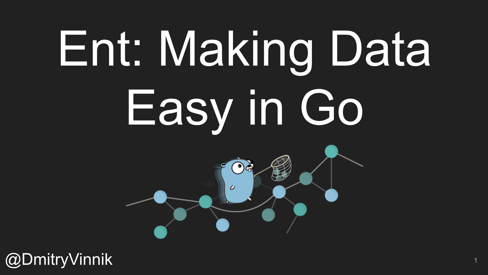

**Elevator Pitch (~300 words)**

In this talk, we will learn how to use Ent when dealing with data schemas, including types, relations and constraints. It’s a hands-on talk, so get ready to follow along!

**Abstract**
 
What do most applications do these days? They interact with data in one way or another. As your app’s scale increases, it becomes more challenging to manage databases, schemas, queries, and constraints. These challenges are why a technique called Object-Relational Mapping, or ORM, was created.

At Meta, we tend to think about data modeling in graph concepts and as we were working with Go, it led us to create a new open source project, Ent.

Ent is an entity framework built for Go programming language. This framework provides developers with a Graph-based, Object Relational Mapping.

In this talk, we will learn how to use Ent when dealing with data schemas, including types, relations and constraints. It’s a hands-on talk, so get ready to follow along!

**Presented at**

 

- [Conf42 - Golang: 2021](https://dvinnik.dev/events/2021/conf42-golang)
- [Go West: 2021](https://dvinnik.dev/events/2021/go-west)

 

**Recording**

 

<iframe width="560" height="315" src="https://www.youtube.com/embed/dOE_UEwzgMw" title="YouTube video player" frameborder="0" allow="accelerometer; autoplay; clipboard-write; encrypted-media; gyroscope; picture-in-picture" allowfullscreen></iframe>

*[Conf42 - Golang: 2021](https://dvinnik.dev/events/2021/conf42-golang)*

 

<iframe width="560" height="315" src="https://www.youtube.com/embed/NvjvzYacgQg" title="YouTube video player" frameborder="0" allow="accelerometer; autoplay; clipboard-write; encrypted-media; gyroscope; picture-in-picture" allowfullscreen></iframe>

*[Go West: 2021](https://dvinnik.dev/events/2021/go-west)*
 

**Slide Deck**

 

<iframe src="//www.slideshare.net/slideshow/embed_code/key/hXGFmDRDYaEy0P" width="595" height="485" frameborder="0" marginwidth="0" marginheight="0" scrolling="no" style="border:1px solid #CCC; border-width:1px; margin-bottom:5px; max-width: 100%;" allowfullscreen> </iframe> 
 <strong> <a href="//www.slideshare.net/DmitryVinnik1/ent-making-data-easy-in-go" title="Ent: Making Data Easy in Go" target="_blank">Ent: Making Data Easy in Go</a> </strong> from <strong><a href="//www.slideshare.net/DmitryVinnik1" target="_blank">Dmitry Vinnik</a></strong> 
