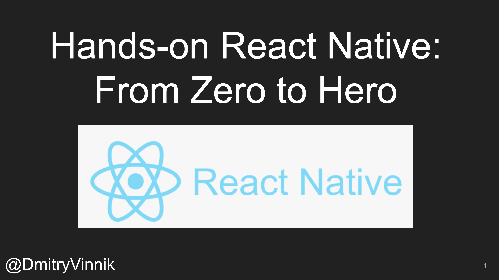

**Elevator Pitch (~300 words)**

In this session, we explore React Native and its main concepts. Then, we build a demo app from scratch for Android and iOS to show the power of cross-platform that the framework brings to the table!

**Presented at**

 

- [All Things Open: 2021](https://dvinnik.dev/events/2021/allthingsopen)
- [TechBash: 2021](https://dvinnik.dev/events/2021/techbash)
- [WeAreDevelopers - Mobile Day: 2021](https://dvinnik.dev/events/2021/wearedevelopers-mobile-day)
- [Porto Tech Hub: 2021](https://dvinnik.dev/events/2021/porto-tech-hub)

 

**Abstract**
 
So many platforms, so little time. How do we write an app for the web, Android, iOS, and other OS without spending all our time and money? Cross-platform can be your answer!

You probably heard about React Native before, a framework that allows you to create native Android and iOS apps using React. But how do you get started with the framework? Whether you are an advanced iOS developer or a beginner React dev, this talk will help you get started with React Native.

In this session, we explore React Native and its main concepts. Then, we will build a demo app from scratch for Android and iOS to show the power of cross-platform that the framework brings to the table!

**Recording**

 

<iframe width="560" height="315" src="https://www.youtube.com/embed/9tXktXR9iJk" title="YouTube video player" frameborder="0" allow="accelerometer; autoplay; clipboard-write; encrypted-media; gyroscope; picture-in-picture" allowfullscreen></iframe>

*[All Things Open: 2021](https://dvinnik.dev/events/2021/allthingsopen)*

 
 

<iframe width="560" height="315" src="https://www.youtube.com/embed/3J4hlbpczY8" title="YouTube video player" frameborder="0" allow="accelerometer; autoplay; clipboard-write; encrypted-media; gyroscope; picture-in-picture" allowfullscreen></iframe>

*[Porto Tech Hub: 2021](https://dvinnik.dev/events/2021/porto-tech-hub)*

 

 

<iframe src="https://player.vimeo.com/video/639870487?h=ff1b58e6e7&title=0&byline=0&portrait=0" width="640" height="360" frameborder="0" allow="autoplay; fullscreen; picture-in-picture" allowfullscreen></iframe>

<a href="https://vimeo.com/639870487">WeAreDevelopers Live - Mobile Day</a> from <a href="https://vimeo.com/wearedevelopers">WeAreDevelopers</a> on <a href="https://vimeo.com">Vimeo</a>.

*Starting from 4:59:00*

*[WeAreDevelopers - Mobile Day: 2021](https://dvinnik.dev/events/2021/wearedevelopers-mobile-day)*

 

**Slide Deck**

 

<iframe src="//www.slideshare.net/slideshow/embed_code/key/5XSEN0oWtt3QZ" width="595" height="485" frameborder="0" marginwidth="0" marginheight="0" scrolling="no" style="border:1px solid #CCC; border-width:1px; margin-bottom:5px; max-width: 100%;" allowfullscreen> </iframe> 
 <strong> <a href="//www.slideshare.net/DmitryVinnik1/hands-on-react-native-from-zero-to-hero" title="Hands on React Native: From Zero to Hero" target="_blank">Hands on React Native: From Zero to Hero</a> </strong> from <strong><a href="//www.slideshare.net/DmitryVinnik1" target="_blank">Dmitry Vinnik</a></strong> 

**Press Mentions**

- [Business Insider: Why companies like Microsoft and Shopify are making big bets on the React Native app development framework, paying specialists an average of $117,000 a year](https://www.businessinsider.com/react-native-developers-facebook-microsoft-app-development-2021-9)