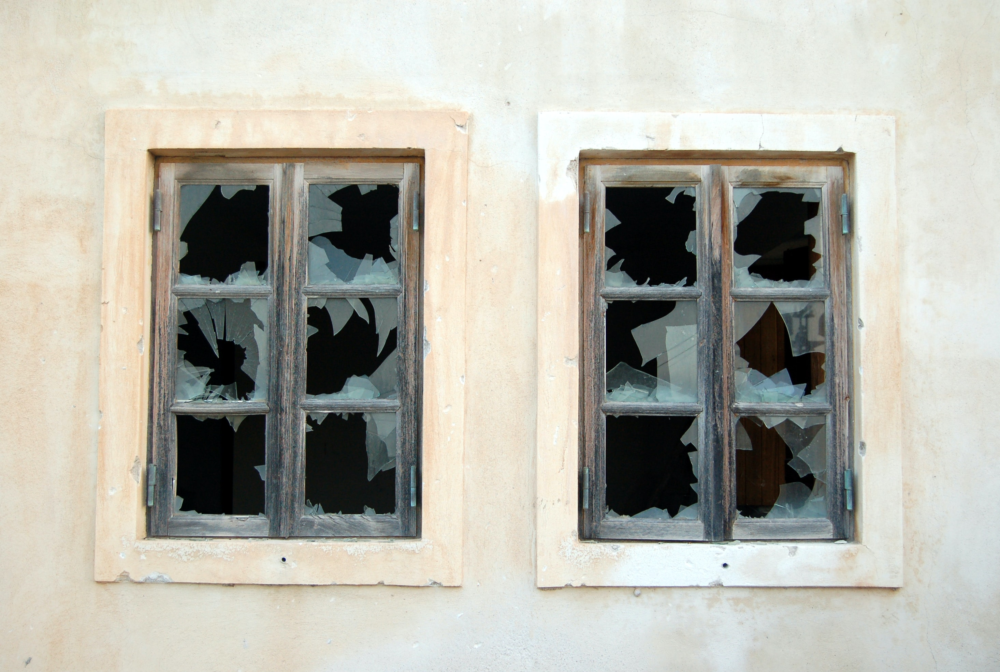

**Elevator Pitch (~300 words)**

In this talk, we discuss how to break away from standard bad development practices and how to address major gaps in your legacy and current codebases. We look at ways to change your development focus towards higher quality practices on both team and organizational levels.

**Presented at**

 

- [Conf42 SRE: 2021]()
- [Booster Conf: 2019]()
- [STPCon: 2018]()

 

**Abstract**
 
We all encountered a “Broken Window” theory in practice. The original idea was that if someone breaks a window in a neighborhood and this window is not repaired right away, the entire area will start getting messier at an accelerated rate.

The same theory is also true for Software Development. How many times have you looked at a legacy system with no code coverage, and decided not to write any tests because "this is how we do things here"? These bad practices behave just like those "Broken Windows." They cause our code to degrade and become unusable.

In this talk, we discuss how to break away from bad development practices and how to address significant gaps in your legacy and current systems. We look at ways to lead by example successfully and introduce refactoring culture into your team and organization. We cover tips and tricks that help improve the development culture and emphasize the codebase's general health.

**Takeaways**

 

1. Common Anti-Patterns of Development Teams
2. Ways to address Legacy Systems' Gaps
3. Tips and Trick on emphasizing High Quality of the codebase

**Recording**

 

<iframe width="560" height="315" src="https://www.youtube.com/embed/tCT-LSbF-uU" title="YouTube video player" frameborder="0" allow="accelerometer; autoplay; clipboard-write; encrypted-media; gyroscope; picture-in-picture" allowfullscreen></iframe>

*[Conf42 - SRE: 2021]()*

 

**Slide Deck**

 

<iframe src="//www.slideshare.net/slideshow/embed_code/key/C6EG9dtMYB1d92" width="595" height="485" frameborder="0" marginwidth="0" marginheight="0" scrolling="no" style="border:1px solid #CCC; border-width:1px; margin-bottom:5px; max-width: 100%;" allowfullscreen> </iframe> 
 <strong> <a href="//www.slideshare.net/DmitryVinnik1/fixing-broken-windows-dealing-with-legacy-systems-poor-quality-and-gaps" title="Fixing Broken Windows: Dealing with Legacy Systems, Poor Quality and Gaps" target="_blank">Fixing Broken Windows: Dealing with Legacy Systems, Poor Quality and Gaps</a> </strong> de <strong><a href="//www.slideshare.net/DmitryVinnik1" target="_blank">Dmitry Vinnik</a></strong> 

 

**Press Mentions/Articles**

- [LeadDev: Fixing broken windows: How to deal with legacy systems]()