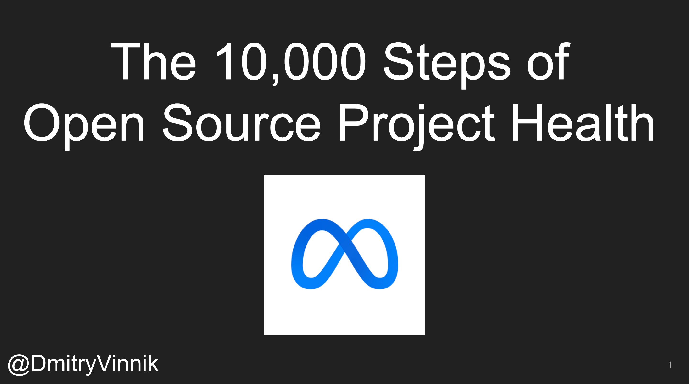

**Elevator Pitch (~300 words)**

In this talk, we will look at the approach that the Meta Open Source team takes to measure the current state of Meta open source projects, and how we use these metrics to prioritize and to direct our DevRel focus.

**Presented at**

 

- [Python Web Conf: 2022]()
- [Open Source Summit - North America: 2022]()
- [Open Source Festival: 2022]()
- [GDG DevFest UK & Ireland: 2022]()
- [JavaScript and Friends: 2021]()

 

**Abstract**
 
Human health is complex - it's not something we can buy; it's something we have to earn! This exact approach goes for open source projects and their communities. A truly dedicated and loyal fanbase cannot be bought; it has to be nurtured. But what do we mean when we call a community and the open source project "healthy"? This question is what we are trying to answer at Meta!

In this talk, we will look at the approach that the Meta Open Source team takes to measure the current state of Meta open source projects, and how we use these metrics to prioritize and to direct our DevRel focus. Ultimately, we aim to show how by looking at information about your open source communities, your team can concentrate on the quality of the projects instead of only the quantity of repositories that you make public. 

 

**Recordings**

 

<iframe width="560" height="315" src="https://www.youtube.com/embed/ltIy6OwBB5o" title="YouTube video player" frameborder="0" allow="accelerometer; autoplay; clipboard-write; encrypted-media; gyroscope; picture-in-picture" allowfullscreen></iframe>

*[Python Web Con: 2021]()*

 

 

<iframe width="560" height="315" src="https://www.youtube.com/embed/-vXXQgAJnOk" title="YouTube video player" frameborder="0" allow="accelerometer; autoplay; clipboard-write; encrypted-media; gyroscope; picture-in-picture" allowfullscreen></iframe>

*[Testμ: 2022]()*

 

 

<iframe width="560" height="315" src="https://www.youtube.com/embed/m8Ufvyo1tJM" title="YouTube video player" frameborder="0" allow="accelerometer; autoplay; clipboard-write; encrypted-media; gyroscope; picture-in-picture" allowfullscreen></iframe>

*[Open Source Festival: 2022]()*

 

 

<iframe width="560" height="315" src="https://www.youtube.com/embed/4phw1GjfCjQ?start=13980" title="YouTube video player" frameborder="0" allow="accelerometer; autoplay; clipboard-write; encrypted-media; gyroscope; picture-in-picture" allowfullscreen></iframe>

*[JavaScript and Friends: 2021]()*

 

 

<iframe width="560" height="315" src="https://www.youtube.com/embed/5KixD9LVymo" title="YouTube video player" frameborder="0" allow="accelerometer; autoplay; clipboard-write; encrypted-media; gyroscope; picture-in-picture" allowfullscreen></iframe>

*[Upstream: 2021]()*

 

**Slide Deck**

 

<iframe src="//www.slideshare.net/slideshow/embed_code/key/GdE1W893H1vUMP" width="595" height="485" frameborder="0" marginwidth="0" marginheight="0" scrolling="no" style="border:1px solid #CCC; border-width:1px; margin-bottom:5px; max-width: 100%;" allowfullscreen> </iframe> 
 <strong> <a href="//www.slideshare.net/DmitryVinnik1/the-10000-steps-of-open-source-project-health" title="The 10,000 Steps of Open Source Project Health" target="_blank">The 10,000 Steps of Open Source Project Health</a> </strong> from <strong><a href="//www.slideshare.net/DmitryVinnik1" target="_blank">Dmitry Vinnik</a></strong> 

- **Press Mentions/Articles**

- [The Recursive: DevTalks 2022](https://therecursive.com/devtalks-2022-the-largest-it-conference-in-romania-to-focus-on-ai/)

- [The Hipo: DevTalks 2022](https://www.hipo.ro/locuri-de-munca/vizualizareArticol/3351/DevTalks-revine-%C3%AEn-perioada-8-10-iunie%3A-Acum-te-po%C8%9Bi-pre%C3%AEnregistra-gratuit-pentru-a-avea-acces-la-conferin%C8%9Bele-online)

- [The 10,000 Steps of Open Source Project Health: Dmitry Vinnik [Testμ 2022]](https://www.lambdatest.com/blog/steps-of-open-source-project-health/)

- [Join upstream maintainers in this new free online event](https://opensource.com/article/21/5/upstream-2021)

- [Open Source Maintainers Take Center Stage, Joined by Leaders from GitHub, Red Hat, Google, and JFrog at Tidelift Upstream Event](https://www.prnewswire.com/news-releases/open-source-maintainers-take-center-stage-joined-by-leaders-from-github-red-hat-google-and-jfrog-at-tidelift-upstream-event-301293468.html)