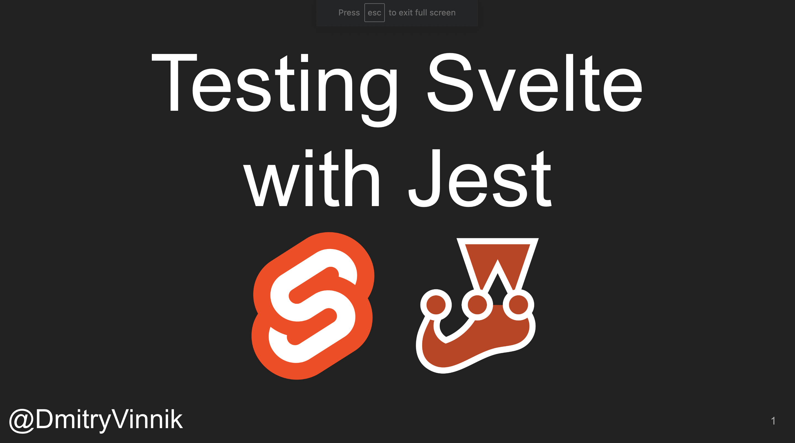

**Elevator Pitch (~300 words)**

In this talk, we look at how React apps are tested E2E and why Jest stands out compared to other test frameworks. We do a live demo while implementing several main test scenarios using Jest, React Testing Library and Puppeteer

**Presented at**

 

- [Svelte Summit Spring: 2021]()

 

**Abstract**
 
How confident are you in your Svelte app? Does your UI render after you add a new item to the nav menu? What about style changes - do you know how a font change affects the rest of your app?

If you want to have confidence in your Svelte app, you need to have tests. Unfortunately, most testing frameworks are hard to set up, and it takes too long to run them. But this is not the case with Jest!

Jest allows Svelte developers to get a quick test result for any change on the app. And setting up Jest on Svelte has never been easier than today!

In this talk, we will look at how Svelte apps are tested E2E and why Jest stands out compared to other test frameworks. We will do a live demo while implementing several main test scenarios using Jest - get ready to code along!

**Recording**

 

<iframe width="560" height="315" src="https://www.youtube.com/embed/fnr9XWvjJHw?start=4194" title="YouTube video player" frameborder="0" allow="accelerometer; autoplay; clipboard-write; encrypted-media; gyroscope; picture-in-picture" allowfullscreen></iframe>

 

**Slide Deck**

 

<iframe src="https://www.slideshare.net/slideshow/embed_code/key/JsyQAVcnL9yCSK?hostedIn=slideshare&page=upload" width="476" height="400" frameborder="0" marginwidth="0" marginheight="0" scrolling="no"></iframe>