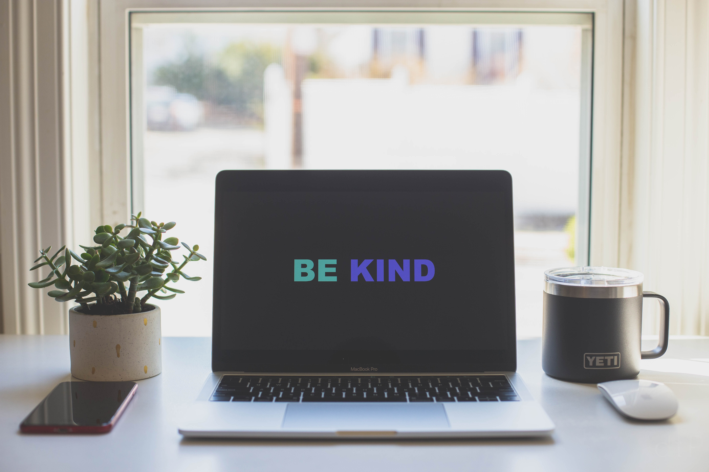

**Elevator Pitch (~300 words)**

With continuous changes in how people communicate, we often face anger, irritation, and selfishness. In this talk, we discuss how to bring kindness to the enterprise and open-source while ensuring that these “kind practices” are successfully adopted by the teams of any size.

**Presented at**

 

- [DevRelCon - San Francisco: 2019]()

 

**Abstract**
 
It is a known saying that if you want to ruin your day, post something publicly and read comments later. While it is an unfortunate truth of modern society to have generally toxic comments sections, you do not usually expect to see something so unkind in the open source section of Software Development. The most prominent examples that come to mind are Linus Torvald's infamous email habits or less known conversations around event-stream libraries and what the maintainers of open source libraries owe to the community that uses these libraries.

In this talk, we will discuss how each person in any enterprise or open-source community can bring clarity to the development process, establish kindness as the critical value in the team, and retain focus on a team’s proactive success. The audience will be able to avoid a reactive approach to any incident resolution and instead highlight how the team can move forward as a cohesive unit rather than a ball of irritation and suppressed anger.

**Takeaways**

 

1. Early signs of toxicity in Open Source or Enterprise Projects
2. Lesson on bringing Empathy to the development process
3. Ways to introduce Kindness as a critical value in the teamwork

**Recording**

 

<iframe width="560" height="315" src="https://www.youtube.com/embed/B2eeOUkTv7A" title="YouTube video player" frameborder="0" allow="accelerometer; autoplay; clipboard-write; encrypted-media; gyroscope; picture-in-picture" allowfullscreen></iframe>

 

**Slide Deck**

 

<iframe src="//www.slideshare.net/slideshow/embed_code/key/y63K7b59WPsA6t" width="595" height="485" frameborder="0" marginwidth="0" marginheight="0" scrolling="no" style="border:1px solid #CCC; border-width:1px; margin-bottom:5px; max-width: 100%;" allowfullscreen> </iframe> 
 <strong> <a href="//www.slideshare.net/DmitryVinnik1/kindness-engineering-focusing-on-what-matters" title="Kindness Engineering: Focusing on What Matters" target="_blank">Kindness Engineering: Focusing on What Matters</a> </strong> from <strong><a href="https://www.slideshare.net/DmitryVinnik1" target="_blank">Dmitry Vinnik</a></strong> 
