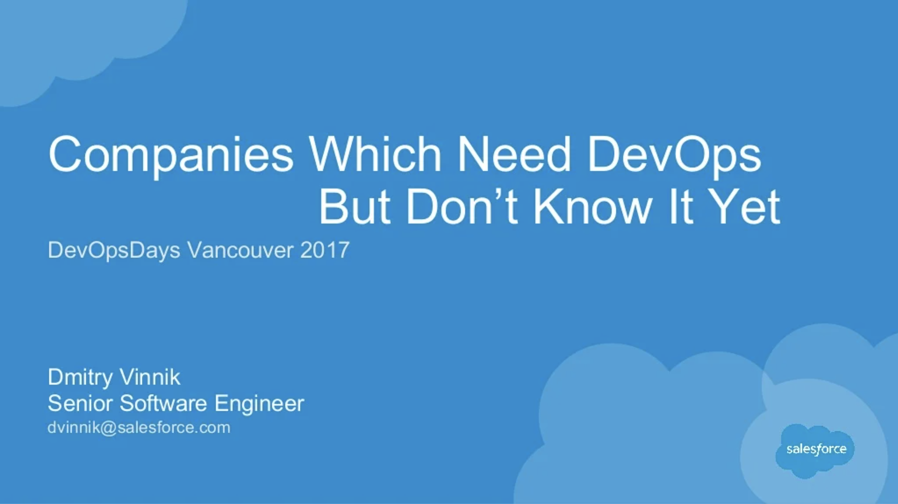

**Elevator Pitch (~300 words)**

In this talk, we will explore that everyone can find something to apply their DevOps skills at, and improve a process in their company.

**Abstract**
 
While many people heard of a word DevOps, very few of them know what this discipline actually means. However, majority of companies find themselves in constant fights with inability to track metrics, to support or to know a status of their own services/products. Some companies buy third-party software, some hire semi-technical staff to manually monitor environments, and in the worst case “let the service run itself”. 

In this talk, we will explore that everyone can find something to apply their DevOps skills at, and improve a process in their company. The talk is mostly based on the speaker’s experience which involves him implementing a variety of automations, and metrics systems to increase productivity and efficiency across different departments in his organization. The main takeaway from this talk is that DevOps is not a title but a mindset, and that every company might use some of this DevOps magic.

**Presented at**

 

- [DevOpsDays YVR: 2017](http://dvinnik.dev/events/2017/devopsdays-vancouver/)

 

**Recording**

 

<iframe width="560" height="315" src="https://www.youtube.com/embed/0rqwn4oXRMw" title="YouTube video player" frameborder="0" allow="accelerometer; autoplay; clipboard-write; encrypted-media; gyroscope; picture-in-picture" allowfullscreen></iframe>

 

**Slide Deck**

 

<iframe src="//www.slideshare.net/slideshow/embed_code/key/2HAmbuSB6O1Kx0" width="595" height="485" frameborder="0" marginwidth="0" marginheight="0" scrolling="no" style="border:1px solid #CCC; border-width:1px; margin-bottom:5px; max-width: 100%;" allowfullscreen> </iframe> 
 <strong> <a href="//www.slideshare.net/DmitryVinnik1/companies-which-need-devops-but-dont-know-about-it" title="Companies Which Need DevOps But Don&#39;t Know About It" target="_blank">Companies Which Need DevOps But Don&#39;t Know About It</a> </strong> from <strong><a href="//www.slideshare.net/DmitryVinnik1" target="_blank">Dmitry Vinnik</a></strong> 
