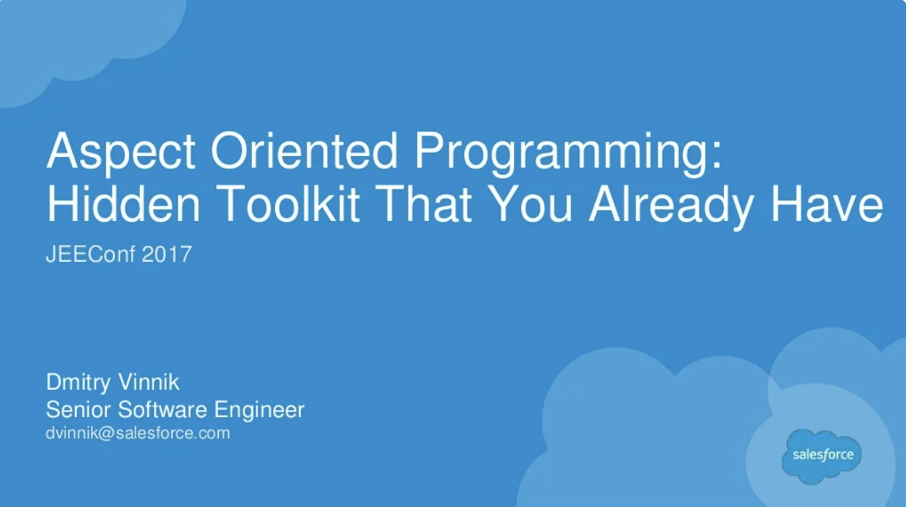

**Elevator Pitch (~300 words)**

This talk’s main goal is to show a real power of AOP with focus on how it is already used in the industry, and how any engineer can write their own AOP application, or Java Agent. As a part of this talk, the speaker will cover common Open Source Java Agents such as JaCoCo and JMH, and touch based on paid-base Java Agents such as JRebel or AppDynamics.

**Abstract**
 
Any developer that worked on a software projects, considered at one point few things like how fast his/her function is, how much test coverage do they have, or if there is a better way to recompile their code without a need to restart JVM. All of these questions can be answered by Aspect Oriented Programming.

Aspect Oriented Programming (AOP) is a cross-cutting concern of writing code across modules to bring a common feature to variety of methods, classes and packages. To illustrate, AOP allows developers to see which parts of actual code was triggered by a test, or to see performance metrics of a certain function. These examples can also be extended to how JVM sees source code and goes beyond Hot Swap in recompiling in runtime using Aspect Oriented Programming.

This talk’s main goal is to show a real power of AOP with focus on how it is already used in the industry, and how any engineer can write their own AOP application, or Java Agent. As a part of this talk, the speaker will cover common Open Source Java Agents such as JaCoCo and JMH, and touch based on paid-base Java Agents such as JRebel or AppDynamics.

**Presented at**

 

- [JEEConf: 2017](http://dvinnik.dev/events/2017/jeeconf/)

 

**Recording**

 

<iframe width="560" height="315" src="https://www.youtube.com/embed/XmuwLYdYDAk" title="YouTube video player" frameborder="0" allow="accelerometer; autoplay; clipboard-write; encrypted-media; gyroscope; picture-in-picture" allowfullscreen></iframe>

 

**Slide Deck**

 

<iframe src="//www.slideshare.net/slideshow/embed_code/key/n0xvZuV80g3fa" width="595" height="485" frameborder="0" marginwidth="0" marginheight="0" scrolling="no" style="border:1px solid #CCC; border-width:1px; margin-bottom:5px; max-width: 100%;" allowfullscreen> </iframe> 
 <strong> <a href="//www.slideshare.net/DmitryVinnik1/back-to-the-completablefuture-concurrency-in-action-128736890" title="Back to the CompletableFuture: Concurrency in Action" target="_blank">Back to the CompletableFuture: Concurrency in Action</a> </strong> from <strong><a href="https://www.slideshare.net/DmitryVinnik1" target="_blank">Dmitry Vinnik</a></strong> 

