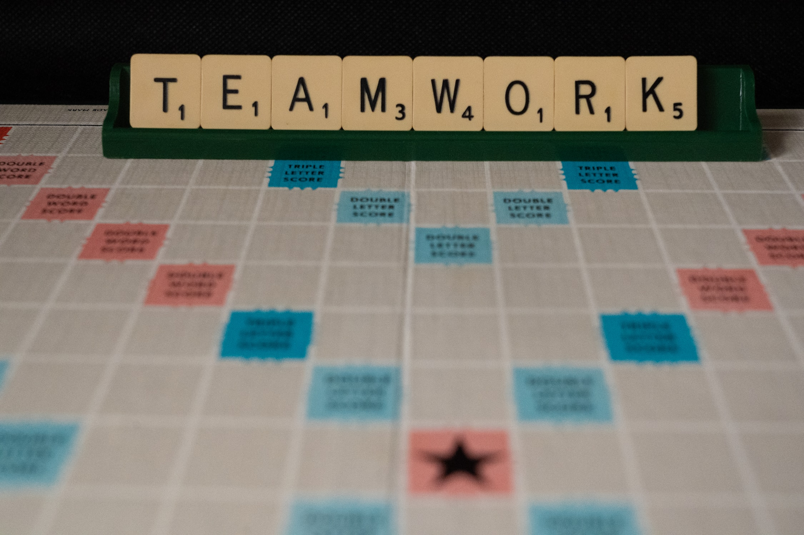

**Elevator Pitch (~300 words)**

In this talk, we discuss how, as a leader, you should lead by example towards a more productive workflow. The audience will learn tips and tricks of making an open office plan work, or if all fails, on how to move to a remote model without getting burned by it.

**Abstract**
 
Where did my day go? What have I done today? If you have asked yourself any of these questions, you are not alone. And even if you don't question your time, your team does. 

With the constant interruption of Instant Messaging, email checking, non-stop meetings, and watercooler conversations, your team is losing valuable time, resulting in overtime. The timelines begin to slip while the team’s mental and physical health is put under constant stress. Ultimately, with this "lost time", your team becomes unsatisfied with the work they do and get unhealthy work-life disbalance.

In this talk, we discuss how, as a leader, you should lead by example towards a more productive, focused, and healthy workflow. The audience will learn tips and tricks of making an open office plan work, or if all fails, on how to move to a remote model without getting burned by it. Ultimately, the talk’s takeaways will be guidelines on retrieving "lost time" and bringing productivity back into your work routine.

**Takeaways**

1. Leadership by example in a nutshell 
2. Techniques for identifying productivity gaps and helping to resolve them
3. Guidelines to ensure a healthy combination of efficiency and work-life balance