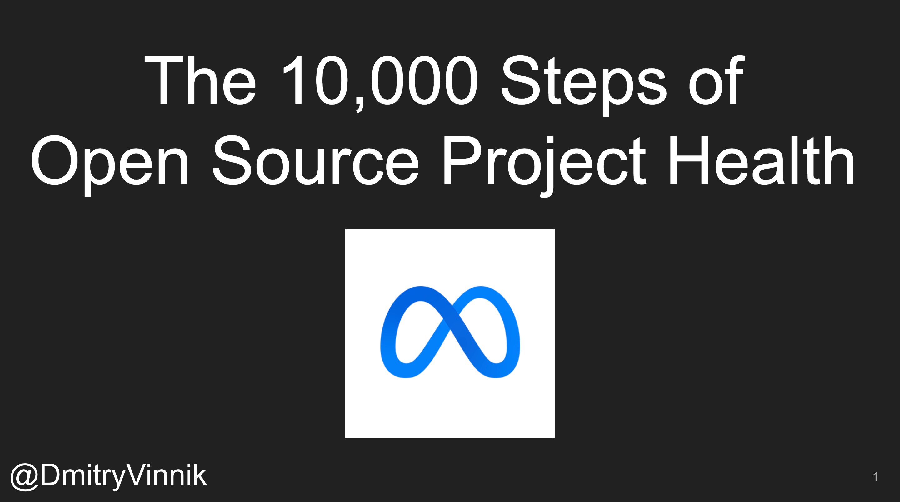

**Elevator Pitch (~300 words)**

In this talk, we will look at the approach that the Meta Open Source team takes to measure the current state of Meta open source projects, and how we use these metrics to prioritize and to direct our DevRel focus.

**Presented at**

 

- [Developer Week - Virtual: 2022]()

 

**Abstract**
 
Human health is complex - it's not something we can buy; it's something we have to earn! This exact approach goes for open source projects and their communities. A truly dedicated and loyal fanbase cannot be bought; it has to be nurtured. But what do we mean when we call a community and the open source project "healthy"? This question is what we are trying to answer at Meta!

In this talk, we will look at the approach that the Meta Open Source team takes to measure the current state of Meta open source projects, and how we use these metrics to prioritize and to direct our DevRel focus. Ultimately, we aim to show how by looking at information about your open source communities, your team can concentrate on the quality of the projects instead of only the quantity of repositories that you make public. 

**Slide Deck**

 

<iframe src="//www.slideshare.net/slideshow/embed_code/key/GdE1W893H1vUMP" width="595" height="485" frameborder="0" marginwidth="0" marginheight="0" scrolling="no" style="border:1px solid #CCC; border-width:1px; margin-bottom:5px; max-width: 100%;" allowfullscreen> </iframe> 
 <strong> <a href="//www.slideshare.net/DmitryVinnik1/the-10000-steps-of-open-source-project-health" title="The 10,000 Steps of Open Source Project Health" target="_blank">The 10,000 Steps of Open Source Project Health</a> </strong> from <strong><a href="//www.slideshare.net/DmitryVinnik1" target="_blank">Dmitry Vinnik</a></strong> 
