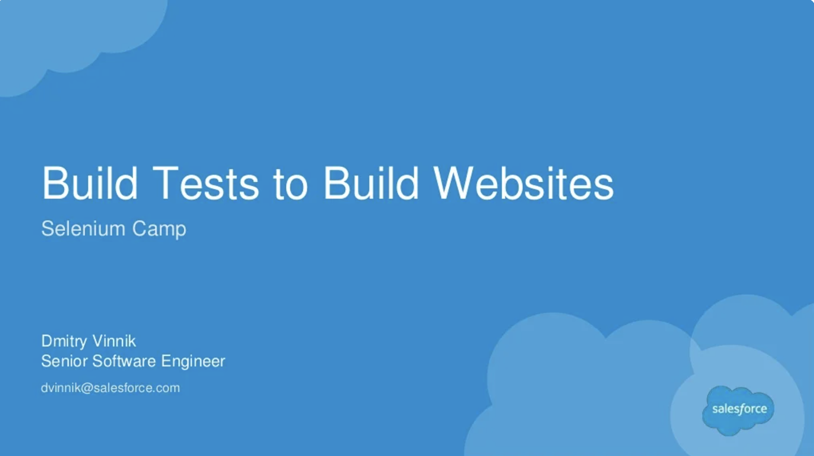

**Elevator Pitch (~300 words)**

In this talk, we will explore how multi-frame platform can be directly mapped to POM for Selenium Webdriver, and how client side code is developed to support this pattern.

**Abstract**
 
Technologies like Squarespace, Salesforce, WordPress, or WIX are extremely popular for those who want to create a working website without necessary developer knowledge. In this talk, I would explore how Salesforce uses Page Object Model patterns to test its Communities platform which is used to develop websites for Salesforce users.

Throughout the talk, we will explore how multi-frame platform can be directly mapped to POM for Selenium Webdriver, and how client side code is developed to support this pattern.

The importance and complexity of these test framework is that it needs to be applicable for both platform and produced websites.

**Presented at**

 

- [CAST: 2017](https://dvinnik.dev/events/2017/cast/)
- [DevOpsDays YVR: 2017](https://dvinnik.dev/events/2017/devopsdays-vancouver/)

 

**Recording**

 

<iframe width="560" height="315" src="https://www.youtube.com/embed/6opoooLdonI" title="YouTube video player" frameborder="0" allow="accelerometer; autoplay; clipboard-write; encrypted-media; gyroscope; picture-in-picture" allowfullscreen></iframe>
 

**Slide Deck**

 

<iframe src="//www.slideshare.net/slideshow/embed_code/key/8vZJWCIvlE5HbF" width="595" height="485" frameborder="0" marginwidth="0" marginheight="0" scrolling="no" style="border:1px solid #CCC; border-width:1px; margin-bottom:5px; max-width: 100%;" allowfullscreen> </iframe> 
 <strong> <a href="//www.slideshare.net/DmitryVinnik1/build-tests-to-build-websites" title="Build Tests to Build Websites" target="_blank">Build Tests to Build Websites</a> </strong> from <strong><a href="//www.slideshare.net/DmitryVinnik1" target="_blank">Dmitry Vinnik</a></strong> 

