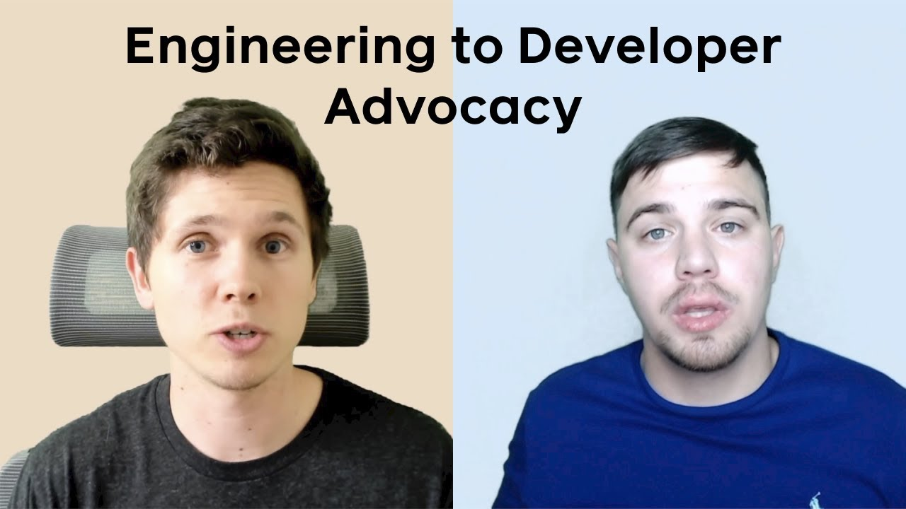

**Title**

From Engineering to Developer Advocacy

**Recording**

<iframe width="560" height="315" src="https://www.youtube.com/embed/9c5j0fCh81c" title="YouTube video player" frameborder="0" allow="accelerometer; autoplay; clipboard-write; encrypted-media; gyroscope; picture-in-picture" allowfullscreen></iframe>

 

**Video Information**

From software engineers to developer advocates, Dmitry Vinnik and Joe Previte share their stories and give advice on how one can make the transition.

