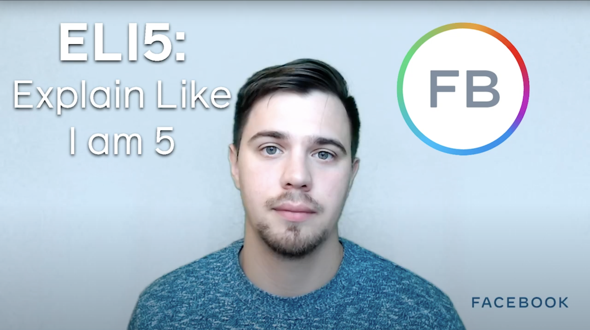

**Title**

Introducing ELI5: Explain Like I'm 5 @FB Open Source

**Recording**

<iframe width="560" height="315" src="https://www.youtube.com/embed/d9eyN4QpS6o" title="YouTube video player" frameborder="0" allow="accelerometer; autoplay; clipboard-write; encrypted-media; gyroscope; picture-in-picture" allowfullscreen></iframe>

 

**Video Information**

In this video, Dmitry Vinnik, Developer Advocate for Facebook Open Source, introduces a new series of short videos about Facebook open source projects. A style in which this series is done is commonly known as ELI5: Explain Like I'm 5, but we apply it to the Facebook OSS. 

