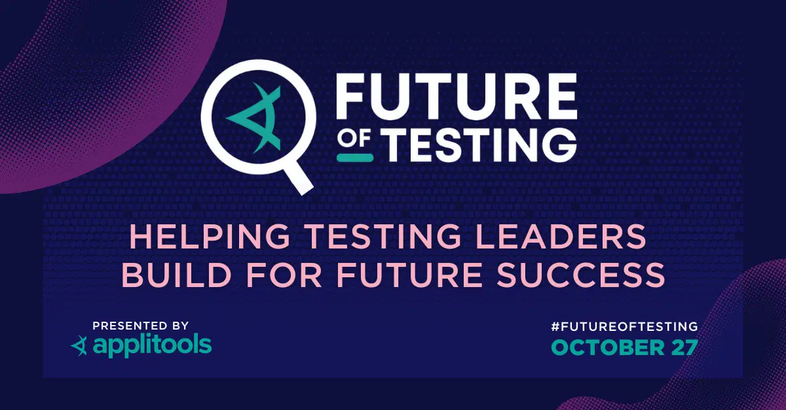

**Title**

Testing at Scale at Meta and Salesforce

**Recording**

[Link to the external site](https://applitools.com/event/testing-at-scale-at-meta-and-salesforce/)

 

**Video Information**

Do you ever worry that your testing skills are too limited for your company? Are you concerned that other organizations, especially the ones with a massive scale, require a completely different set of skills? Worry no more! 

This talk will look at how testing is done at companies with the scale of the likes of Salesforce and Meta. 
We will discuss how the most basic testing skills and tools we use daily that are transferable to any company.

[Link to the talk]()