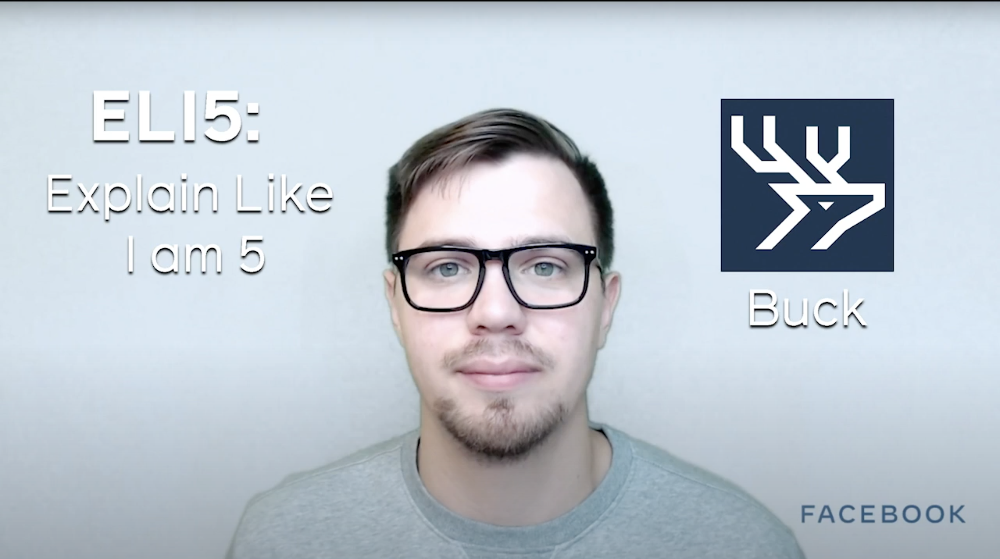

**Title**

Explain Like I'm 5: Buck

**Recording**

<iframe width="560" height="315" src="https://www.youtube.com/embed/TX29-Edcnpg" title="YouTube video player" frameborder="0" allow="accelerometer; autoplay; clipboard-write; encrypted-media; gyroscope; picture-in-picture" allowfullscreen></iframe>

 

**Video Information**

In this video, Facebook Open Source Developer Advocate Dmitry explains Buck, a build system, in 60 seconds.

[Relevant Article Link]()

