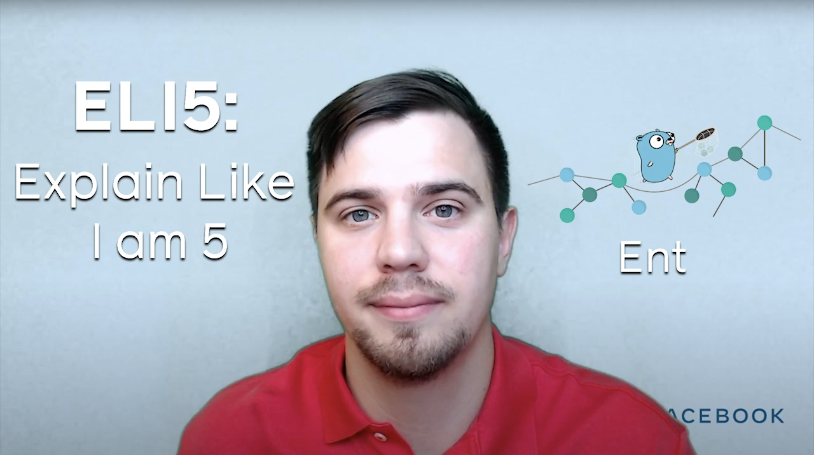

**Title**

Explain Like I'm 5: Ent

**Recording**

<iframe width="560" height="315" src="https://www.youtube.com/embed/RCzeYg-_dbU" title="YouTube video player" frameborder="0" allow="accelerometer; autoplay; clipboard-write; encrypted-media; gyroscope; picture-in-picture" allowfullscreen></iframe>

 

**Video Information**

In this video, Facebook Open Source Developer Advocate Dmitry explains Ent, an entity framework for Go, in 60 seconds.

[Relevant Article Link]()

