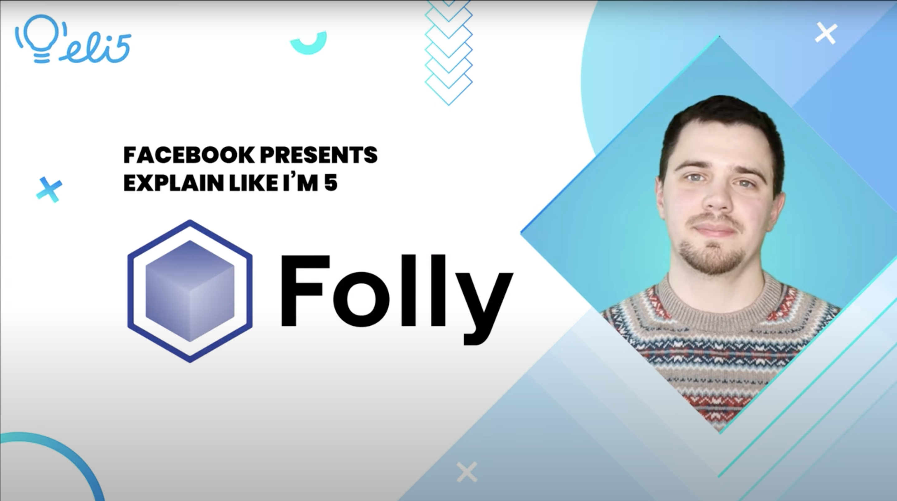

**Title**

Explain Like I'm 5: Folly

**Recording**

<iframe width="560" height="315" src="https://www.youtube.com/embed/Wr_IfOICYSs" title="YouTube video player" frameborder="0" allow="accelerometer; autoplay; clipboard-write; encrypted-media; gyroscope; picture-in-picture" allowfullscreen></iframe>

 

**Video Information**

In this short video, Facebook Open Source Developer Advocate Dmitry Vinnik explains the open source project Folly, an open-source C++ library developed and used at Facebook. 

[Relevant Article Link]()