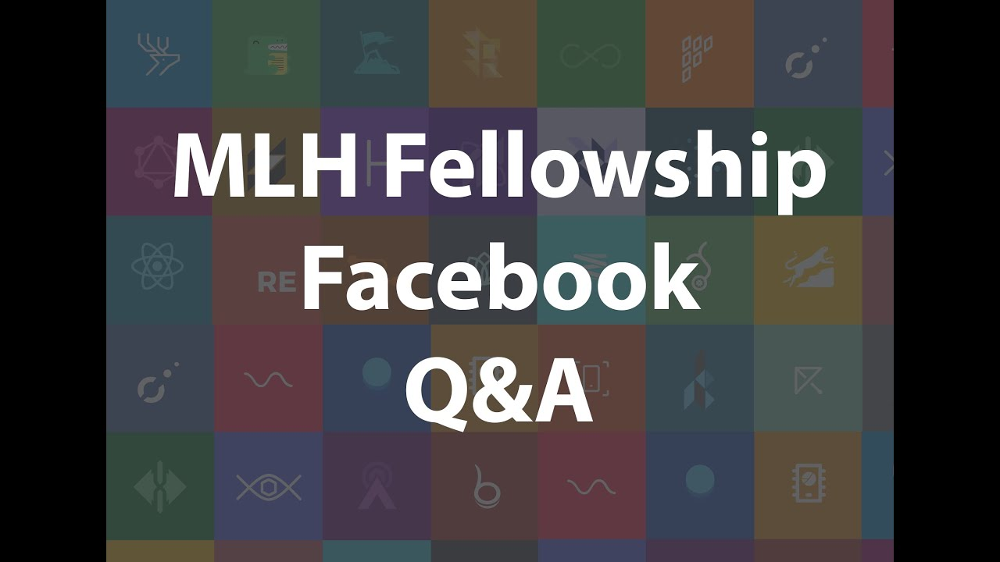

**Title**

MLH Fellowship x Facebook Open Source Q&A

**Recording**

<iframe width="560" height="315" src="https://www.youtube.com/embed/d1XwRIKz15Q" title="YouTube video player" frameborder="0" allow="accelerometer; autoplay; clipboard-write; encrypted-media; gyroscope; picture-in-picture" allowfullscreen></iframe>

 

**Video Information**

In this video, Open Source and Developer Advocate experts answer the questions of fellows from the MLH Fellowship Spring 2021 season of the program.

The Facebook Open Source team has partnered with Major League Hacking (MLH) for the MLH Fellowship program: a 12-week remote fellowship designed to host, mentor, and support developers to hack on Facebook and external open source projects.