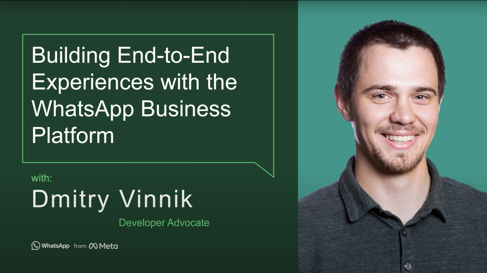

**Title**

Building End-to-End Experiences with the WhatsApp Business Platform

**Recording**

<iframe width="560" height="315" src="https://www.youtube.com/embed/KP6_BUw3i0U" title="YouTube video player" frameborder="0" allow="accelerometer; autoplay; clipboard-write; encrypted-media; gyroscope; picture-in-picture" allowfullscreen></iframe>

 

**Video Information**

In this webinar you’ll learn to see how quickly you can get started with the WhatsApp Business Platform Cloud API. In this session, Developer Advocate Dmitry Vinnik covers building an end-to-end messaging experience. He details both sending and receiving messages with customers. 

If you're looking for ways to connect with your customers using the messaging apps they’re already using with their friends and family – watch today.

00:00 Introduction
03:06 Getting Started with WhatsApp Business Platform and Cloud API
11:05 Creating an App with WhatsApp Business API
21:04 Facilitating Customer Interactions with Webhooks
32:27 Q&A
