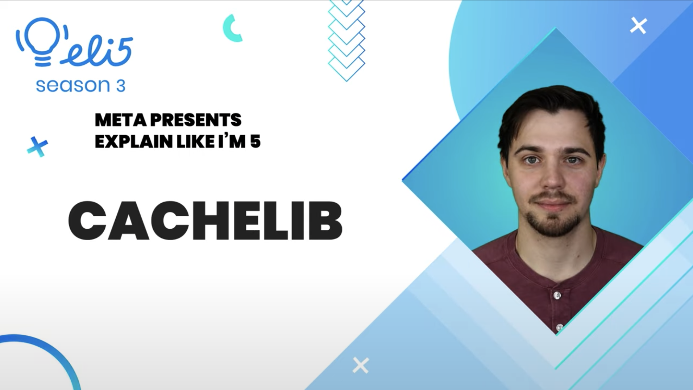

**Title**

Explain Like I’m 5: Haxl

**Recording**

<iframe width="560" height="315" src="https://www.youtube.com/embed/91QljrFmAgk" title="YouTube video player" frameborder="0" allow="accelerometer; autoplay; clipboard-write; encrypted-media; gyroscope; picture-in-picture" allowfullscreen></iframe>

 

**Video Information**

In this video, Meta Open Source Developer Advocate Dmitry explains Haxl, a Haskell library for efficient data access ranging from databases to web-based services. 
