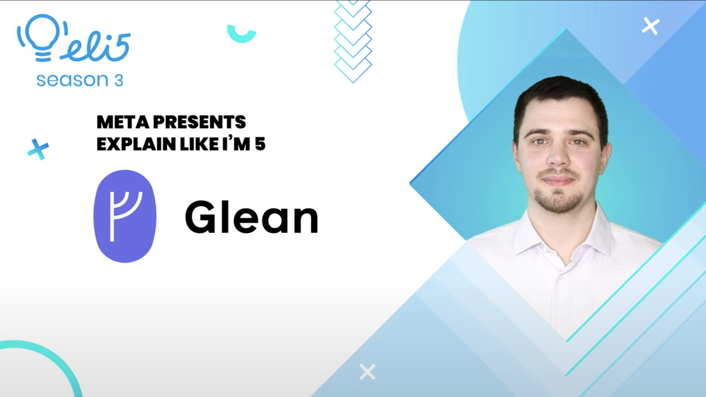

**Title**

Explain Like I’m 5: Glean

**Recording**

<iframe width="560" height="315" src="https://www.youtube.com/embed/pF60pOCkHoE" title="YouTube video player" frameborder="0" allow="accelerometer; autoplay; clipboard-write; encrypted-media; gyroscope; picture-in-picture" allowfullscreen></iframe>

 

**Video Information**

In this video, Meta Open Source Developer Advocate Dmitry explains Glean, an open source system for collecting, deriving and querying facts about source code.